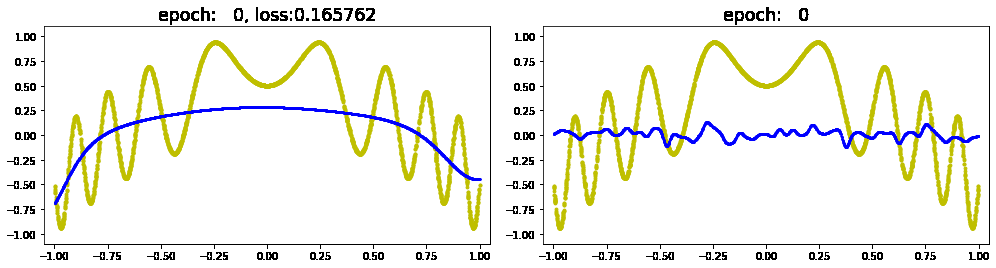

# HWnet 

## 基于“线性嵌入式向量”可在线伸缩“线性回归网络”

### 1. 性能提升

* 左侧:多项式线性回归、Tanh激活函数; 右侧:线性嵌入式向量。
* 训练性能提升近百倍；可以非常接近“全局最优点”。

### 2. 线性回归在大规模网络中的缺陷
* 每一个数据，训练所有参数。
* 每一个参数，参与推断。

### 3. 箱式特征的缺陷
* 分“箱”后，相邻箱过于独立，导致“不圆滑”。
* 稀疏特征导致后端网络规模过大，容易过拟合。

### 3. 线性嵌入式向量
* 通过值域划分，每个值域有各自的向量。
* 对每一个输入值，用所在值域、周边值域的“向量”乘以“权重”的和表征；每个向量的“权重”与输入值与评价点的距离相关。
* 通过“takecare”参数的设定，控制周边值域“向量”的"权重"。
  * 防止过于“独立”导致的“过拟合”、“不圆滑”。
  * 防止过于“关心”导致拟合能力不足。

  * 根据上图可见，当takcare当前值域60%时，只需5个值域的向量参与训练、推断。

### 4. 多维输入与后端网络
* 有多个输入时，每个输入各自“向量化”；将结果合并输入后端网络。
* 后端可以使用各种现有网络。

### 5. 在线伸缩
* 通过对各值域累计损失：大于预期的值域进行分裂，小于预期的值域与周围值域合并。
* 线性嵌入式向量的输出维度固定，后端网络无需重新构建。

### 6. To Do
* 将3月底升级PLUS版本。