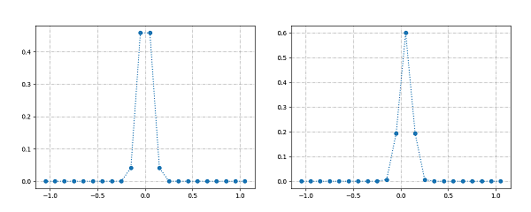

# HWnet 

## 基于“线性嵌入式向量”可在线伸缩“线性回归网络”
## Linear regression network can expand and shrink on line based on "Linear Embedding"
### 1. 性能提升
### 1. Performance

* 左侧:多项式线性回归、Tanh激活函数; 右侧:线性嵌入式向量。
* Left figure: polynomial linear regression, tanh activation; right figure: Linear Embedding.
* 训练性能提升近百倍。
* Nearly hundred times improvement in training.
* 非常接近“全局最优点”。
* Very close to "global best"

### 2. 线性回归在大规模网络中的缺陷
### 2. Defects of linear regression in large net
* 每一个数据训练所有参数。
* Every data train All parameters; All parameters are trained by Each data.
* 每一个参数参与每一次推断。
* Every parameter participates in Each inference; Each inference is base on All parameters.

### 3. 箱式特征的缺陷
### 3. Defects of box features
* 分“箱”后，相邻箱过于独立，导致“不圆滑”。
* After the "box" is divided, the boxes nearby are too independent, which makes results in "not smooth".
* 稀疏特征导致后端网络规模过大，容易过拟合。
* Sparse features make back-end to large and overfitting easily.

### 3. 线性嵌入式向量
### 3. Linear Embedding
* 每个值域有各自的向量。
* Each value field has its own vector.
* 对每一个输入值，用所在值域、周边值域的“向量”乘以“权重”和表征。
* Each input can be described by the sum of "vector" multiply "weight".
* 每个向量的“权重”与输入值与评价点的距离相关。
* The "weight" of each vector is related to the distance between the input and the middle of the value field.
* 通过设定“takecare”参数，控制周边值域“向量”的"权重"。
* By setting the "takecare" parameter can control the "weight" of "vector".
  * 防止过于“独立”导致的“过拟合”、“不圆滑”。
  * Prevent "over fitting" and "non smoothness" caused by less takecare.
  * 防止过于“takecare”导致拟合能力不足。
  * Prevent "under fitting" caused by over takecare.

  * 根据上图可见，当takcare当前值域60%时，只需5个值域的向量参与训练、推断。
  * According to the figure above, when takcare is 60%, only 5 vectors are needed in training and inference.
### 4. 多维输入与后端网络
* 有多个输入时，每个输入各自“向量化”, 将结果合并输入后端网络。
* When there are multiple inputs, each input is "vectorized" to merge and feed into the back-end.
* 后端可以是各种网络, 例如：全连接、LSTM......
* Back-end can be all kinds of net, like full connection, LSTM......

### 5. 在线伸缩
* 通过累计各值域损失: 大于预期的值域进行分裂，小于预期的值域与周围值域合并。
* By accumulating the loss of each value field: larger than expected will be split, less than expected will be merged.
* 线性嵌入式向量的输出维度固定，前端网络伸缩后，后端网络无需重新构建，只需进行少量训练。
* When the output dimension of linear embedding is fixed , after the front-end expand and shrink, the back-end do not need rebuild, only need a little training.
### 6. To Do
* 2周内升级PLUS版本。
* Upgrade PLUS version in 2 weeks.